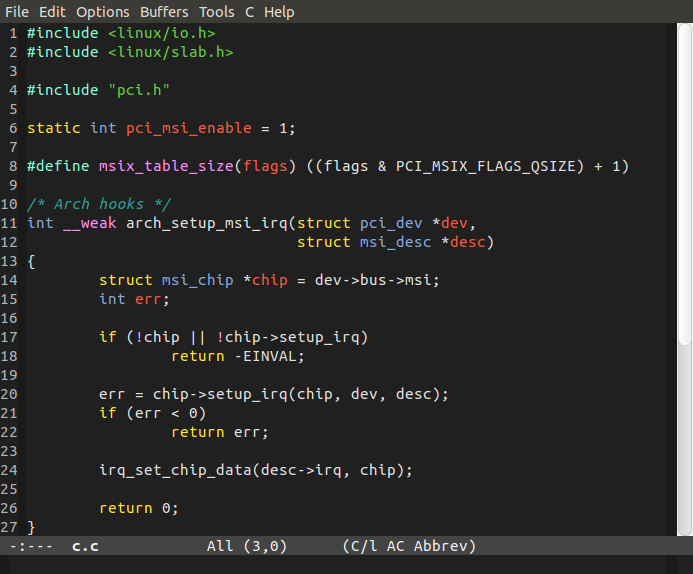
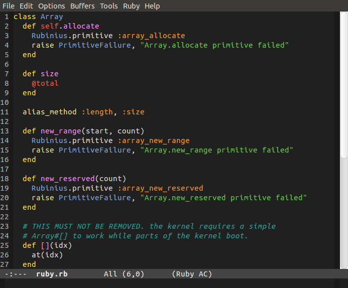
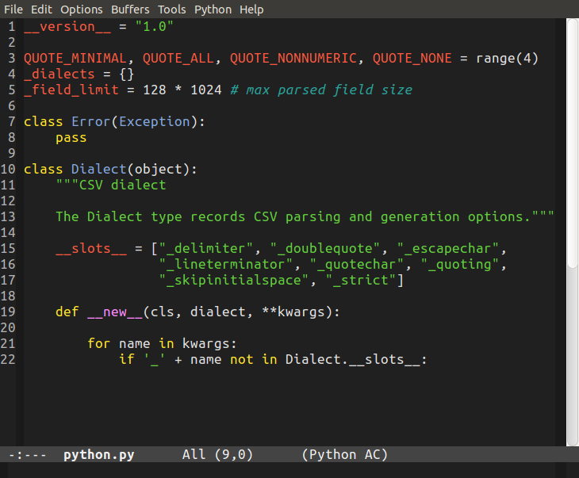

[](http://melpa.org/#/lush-theme)

emacs-lush-theme
================

A dark theme with strong colors for Emacs24, based on [JD Huntington's blackboard theme](http://jdhuntington.com/paste/color-theme-blackboard.el.html)

## Installation

1. If you use [MELPA](http://melpa.milkbox.net), just do:
<kbd>M-x package-install [RET] lush-theme [RET]</kbd>
2. Otherwise, put `lush-theme.el` in your Emacs load path, e.g. `~/.emacs.d/`

You can apply the theme via <kbd>M-x customize-themes</kbd> or make it your default theme by adding the following to your Emacs configuration file:

```el
(load-theme 'lush t)
```

## Screenshots

### C


### Ruby


### Lisp


### Python


## Credits

* [JD Huntington's blackboard theme](http://jdhuntington.com/paste/color-theme-blackboard.el.html)
