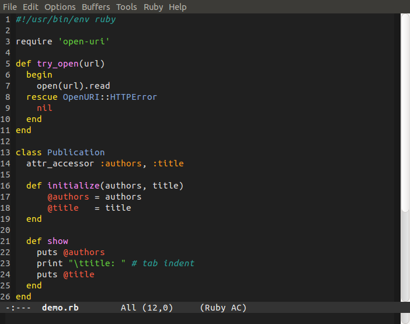
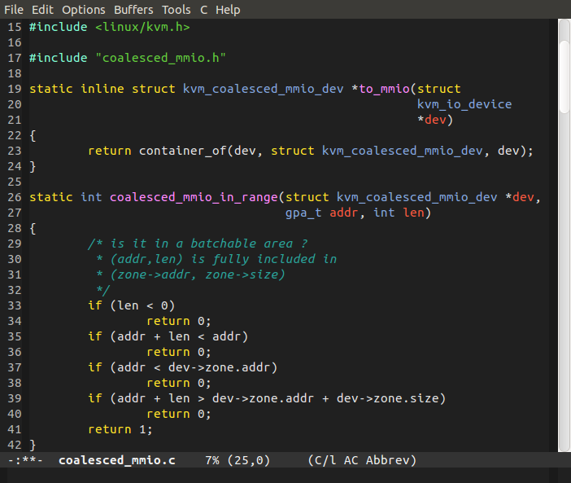

emacs-lush-theme
================

A Dark Theme with strong colors for Emacs24 based on [JD Huntington's blackboard theme](http://blog.jdhuntington.com/2008/11/emacs-color-theme-blackboard.html)

## Installation

Put it in your Emacs load path, e.g. `~/.emacs.d/` and activate it via `M-x customize-themes`, or put the following in your Emacs configuration file:

  (load-theme 'lush t)

## Screenshots

### Ruby

### C

## Credits

* [JD Huntington's blackboard theme](http://blog.jdhuntington.com/2008/11/emacs-color-theme-blackboard.html)
